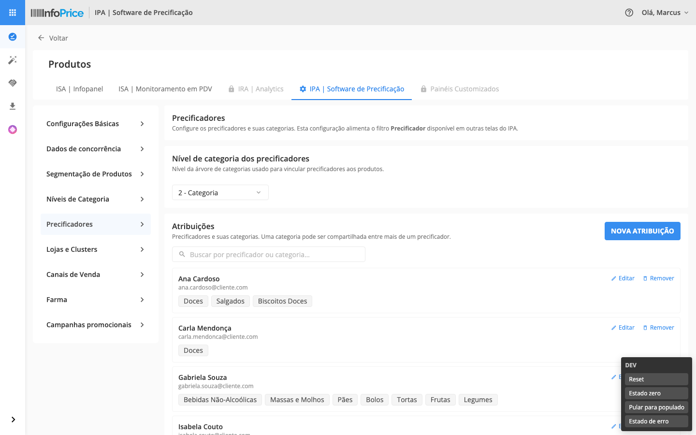
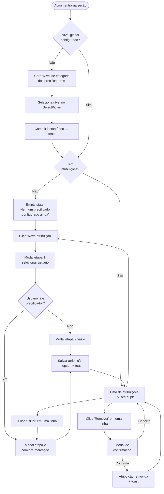
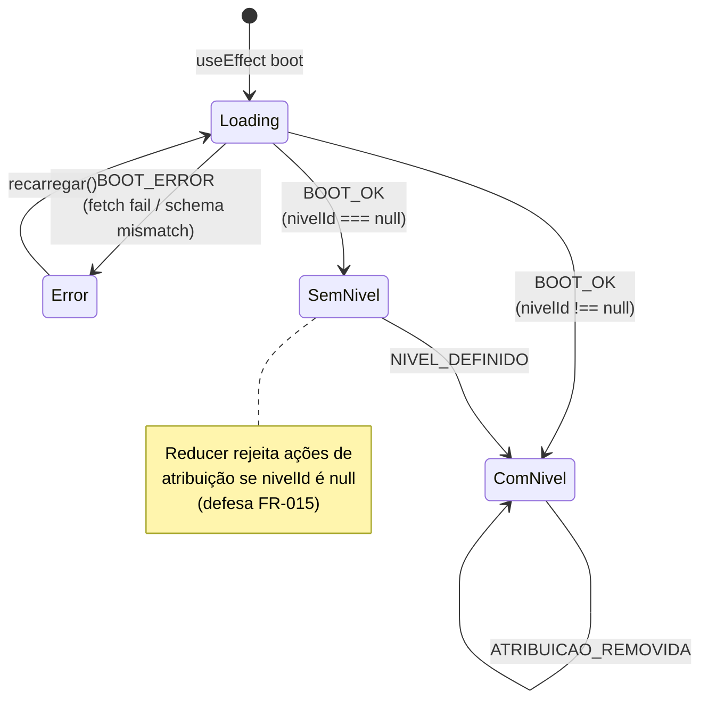
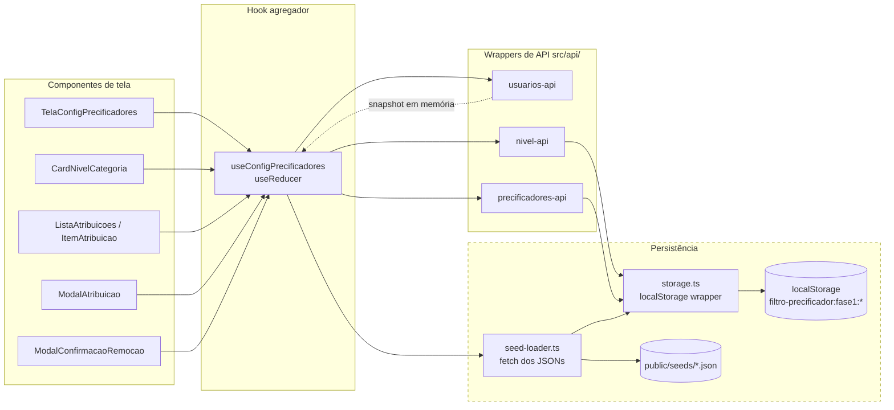

# Handoff — Protótipo Fase 1: Configuração de Precificadores

Documento de transferência do protótipo para o time de desenvolvimento (React/CRA + Java).

**Live**: rodar `npm run dev` → [http://localhost:5173/](http://localhost:5173/)
**Modo dev**: anexar `?dev=1` → [http://localhost:5173/?dev=1](http://localhost:5173/?dev=1) habilita o DevToolbar (canto inferior direito) com botões pra Reset / Estado zero / Pular para populado / Estado de erro.

---

## Screenshots



Lista populada: header + sidebar + sub-menu (Precificadores ativo) + card "Nível de categoria dos precificadores" (SelectPicker em "2 - Categoria") + lista de atribuições com busca dupla + aviso + footer Cancelar/Salvar.

Outros estados navegáveis no protótipo (capturas manuais recomendadas):

- **Estado zero**: `?dev=1` → DevToolbar → "Estado zero" → tela com apenas o card de nível, sem lista.
- **Modal de atribuição (etapa 1)**: clicar em "Nova atribuição" → SearchBar 100% + lista de 13 usuários ativos com badge "já é precificador" em quem tem atribuição.
- **Modal de atribuição (etapa 2)**: selecionar um usuário → checkbox-list de categorias do nível, ChipSobreposicao laranja nas categorias já atribuídas a outros.
- **Modal de remoção**: clicar Remover em qualquer linha → modal pequeno de confirmação com botão vermelho.
- **Estado de erro**: `?dev=1` → DevToolbar → "Estado de erro" → tela de erro com dica de recuperação via DevToolbar.

---

## Fluxogramas

### Jornada do usuário (admin)



### Máquina de estados (`useConfigPrecificadores`)



### Fluxo de dados (UI → Hook → API → Storage)



**No port pra produção**: o bloco `Storage` (linha tracejada) é substituído por chamadas HTTP. APIs (`*-api.ts`) mantêm as mesmas assinaturas — só a implementação interna muda.

---

## 1. Escopo

Nova seção **"Precificadores"** no Administrativo IPA, com:

- Definição de um **nível de categoria global** (Departamento, Categoria, Subcategoria).
- **Atribuição** de N categorias por usuário (precificador). Sobreposição permitida (1 categoria → N precificadores).
- **Lista** com busca dupla (precificador OU categoria), edição e remoção com confirmação.
- Empty states explícitos: sem nível configurado / sem atribuições.

Esta configuração alimenta o filtro **Precificador** das fases seguintes (Gerenciador, Negociações, etc.).

Spec funcional completa: [specs/001-config-precificadores/spec.md](specs/001-config-precificadores/spec.md).

---

## 2. Stack

| Camada | Ferramenta | Versão |
|--------|------------|--------|
| Build / dev server | Vite | 5.4 |
| Plugin React | `@vitejs/plugin-react` | 4.3 |
| Linguagem | TypeScript | 5.6 (strict) |
| UI | React | 18.3 |
| `className` condicional | `clsx` | 2.1 |
| CSS do DS | `.ds-ref/design-system/dist/{tokens,styles}.css` → copiado pra `public/ds/` no `predev`/`prebuild` | snapshot do `produto-ux` |

**Sem outras dependências.** Não há `react-router` (single page com estado React), nem libs de estado externas (`useReducer` + `useState` puros).

A Constitution `.specify/memory/constitution.md` enumera 5 armadilhas Vite-CRA a evitar (sem `import.meta.env`, sem `import.meta.glob`, sem query imports tipo `?raw`, sem CSS via JS pro DS, sem path aliases). O protótipo respeita todas.

---

## 3. Como rodar

```bash
# Pré-requisitos: Node 20+ e o repo .ds-ref/ presente (DS clonado de produto-ux)
npm install
npm run dev          # http://localhost:5173/
npm run build        # gera dist/ estático
npm run preview      # serve dist/ localmente
```

O `predev` e `prebuild` rodam `scripts/copy-ds.mjs` automaticamente, copiando `.ds-ref/design-system/dist/{tokens,styles}.css` para `public/ds/`.

---

## 4. Estrutura de pastas

```text
filtro-precificador/
├── index.html                    # Entry HTML — <link> pra /ds/, fontes, ícones, e CSS de layout específico do protótipo
├── public/
│   ├── ds/                       # gerado por copy-ds.mjs (não versionado)
│   │   ├── tokens.css
│   │   └── styles.css
│   ├── assets/                   # SVGs locais (logo InfoPrice + ícones de sidebar)
│   └── seeds/                    # JSONs realistas
│       ├── usuarios.json
│       ├── niveis-categoria.json
│       ├── categorias.json
│       └── atribuicoes-iniciais.json
├── scripts/
│   └── copy-ds.mjs               # prebuild — copia DS de .ds-ref/ para public/ds/
├── src/
│   ├── main.tsx                  # ReactDOM.createRoot
│   ├── App.tsx                   # Composição: AdminShell + TelaConfigPrecificadores + ToastContainer + DevToolbar
│   ├── types/
│   │   └── index.ts              # DTOs (Usuario, NivelCategoria, Categoria, Atribuicao, ConfiguracaoGlobal)
│   ├── design-system/components/ # Cópia local dos canônicos React do DS
│   │   ├── basic/select-picker/select-picker.react.tsx
│   │   └── compound/
│   │       ├── modal/modal.react.tsx
│   │       └── toast/toast.react.tsx
│   ├── shell/                    # Esqueleto do Administrativo IPA
│   │   ├── HeaderInfoPrice.tsx
│   │   ├── SidebarPrincipal.tsx
│   │   ├── SubMenuConfiguracoes.tsx
│   │   ├── AdminShell.tsx
│   │   └── ip-logo-svg.ts        # (reservado para uso inline; hoje a logo vem por  de /assets/)
│   ├── state/
│   │   ├── storage.ts            # Wrapper localStorage (chaves filtro-precificador:fase1:*)
│   │   ├── seed-loader.ts        # Fetch dos JSONs em /seeds/
│   │   └── useConfigPrecificadores.ts  # Hook agregador com useReducer
│   ├── api/                      # Wrappers que isolam o storage do resto da app
│   │   ├── usuarios-api.ts
│   │   ├── nivel-api.ts
│   │   └── precificadores-api.ts
│   ├── tela/                     # Componentes de tela
│   │   ├── TelaConfigPrecificadores.tsx   # Container principal
│   │   ├── CardNivelCategoria.tsx          # Escolha do nível (SelectPicker)
│   │   ├── EmptyAtribuicoes.tsx
│   │   ├── ListaAtribuicoes.tsx            # Lista com busca dupla
│   │   ├── ItemAtribuicao.tsx              # Linha de cada precificador
│   │   ├── ModalAtribuicao.tsx             # Wrapper modal (2 etapas)
│   │   ├── EtapaSelecionarUsuario.tsx      # Step 1: lista de usuários
│   │   ├── EtapaSelecionarCategorias.tsx   # Step 2: lista de categorias com checkboxes
│   │   ├── ChipSobreposicao.tsx            # Indicador "+N precificadores"
│   │   ├── ModalConfirmacaoRemocao.tsx
│   │   └── DevToolbar.tsx                  # Habilitado via ?dev=1
│   └── util/
│       └── normalize.ts          # NFD + remove diacríticos + lowercase (busca case+accent insensitive)
└── specs/001-config-precificadores/   # Spec Kit (mantém histórico de decisões)
    ├── spec.md
    ├── plan.md
    ├── research.md
    ├── data-model.md
    ├── quickstart.md
    ├── tasks.md
    └── contracts/
        ├── domain-types.ts
        ├── storage.ts
        └── seed-loader.ts
```

---

## 5. Modelo de domínio (DTOs)

Definidos em `src/types/index.ts`. Em `camelCase` PT-BR, antecipando o formato que esperamos da API Java.

```ts
type Usuario = {
  schemaVersion: 1;
  id: string;          // "usr-001"
  nome: string;
  email: string;
  ativo: boolean;
};

type NivelCategoria = {
  schemaVersion: 1;
  id: string;          // "nivel-departamento" | "nivel-categoria" | "nivel-subcategoria"
  nome: string;        // "Departamento" / "Categoria" / "Subcategoria"
  ordem: number;       // 1, 2, 3 (raiz → folha)
};

type Categoria = {
  schemaVersion: 1;
  id: string;          // "cat-doces"
  nome: string;
  nivelId: NivelCategoria['id'];
  caminho: string[];   // ["Mercearia", "Doces"]
  paiId: string | null;
};

type Atribuicao = {
  schemaVersion: 1;
  id: string;                       // crypto.randomUUID()
  usuarioId: Usuario['id'];
  categoriaIds: Categoria['id'][];  // pelo menos 1 (FR-017)
  criadoEm: string;                 // ISO 8601
  atualizadoEm: string;
};

type ConfiguracaoGlobal = {
  schemaVersion: 1;
  nivelId: NivelCategoria['id'] | null;
  atualizadoEm: string | null;
};
```

### Invariantes (regras de negócio)

- `categoriaIds.length >= 1` em toda Atribuicao (FR-017).
- Cada `Usuario` aparece em no máximo **uma** `Atribuicao` (FR-019). Operação "salvar atribuição" é **upsert por usuarioId** — não cria duplicata.
- A mesma `categoriaId` pode aparecer em múltiplas `Atribuicao` — sobreposição permitida (FR-007).
- Toda `categoriaId` em qualquer atribuição **deve** referenciar uma categoria do `nivelId` em `ConfiguracaoGlobal` (FR-001).
- Trocar `ConfiguracaoGlobal.nivelId` quando há atribuições zera todas (FR-016 — aviso inline + commit via SelectPicker change).
- Nenhuma ação de atribuição é exposta enquanto `nivelId === null` (FR-015).

---

## 6. Persistência (localStorage no protótipo, troca por API Java em produção)

### O que persiste no localStorage

| Chave | Conteúdo | Editável pelo app? |
|-------|----------|--------------------|
| `filtro-precificador:fase1:initialized` | sentinela `'true'/'false'` | sim (boot inicial) |
| `filtro-precificador:fase1:configuracao` | `ConfiguracaoGlobal` JSON | sim (definir/trocar nível) |
| `filtro-precificador:fase1:atribuicoes` | `Atribuicao[]` JSON | sim (CRUD) |

### Read-only (não vai pro storage)

Carregado via `fetch` na inicialização do `useConfigPrecificadores`:

- `/seeds/usuarios.json`
- `/seeds/niveis-categoria.json`
- `/seeds/categorias.json`

No port pra produção, essas chamadas viram **HTTP para o backend Java**. Os endpoints são fora do escopo deste protótipo.

### Substituição na produção

Toda a interação com persistência vive em 4 arquivos isolados:

- `src/state/storage.ts` (3 chaves localStorage)
- `src/state/seed-loader.ts` (fetch dos JSONs)
- `src/api/{usuarios,nivel,precificadores}-api.ts` (wrappers sobre storage)

**Em produção**:

1. Substituir `storage.ts` por chamadas HTTP para `GET/POST/PUT/DELETE /admin/precificadores/...` etc.
2. Remover `seed-loader.ts` ou apontar pra endpoints reais (`GET /usuarios/ativos`, `GET /niveis-categoria`, `GET /categorias?nivel=:id`).
3. Os `*-api.ts` continuam com a mesma assinatura — só a implementação interna troca.
4. `useConfigPrecificadores` não muda.
5. Componentes de tela não mudam.

Suggested endpoints (a definir com backend):

```http
GET    /admin/precificadores/configuracao         → ConfiguracaoGlobal
PUT    /admin/precificadores/configuracao         → ConfiguracaoGlobal (com flag resetAtribuicoes)
GET    /admin/precificadores/atribuicoes          → Atribuicao[]
POST   /admin/precificadores/atribuicoes          → Atribuicao (upsert por usuarioId)
DELETE /admin/precificadores/atribuicoes/:id      → 204
GET    /admin/precificadores/usuarios             → Usuario[] (ativos)
GET    /admin/niveis-categoria                    → NivelCategoria[]
GET    /admin/categorias?nivelId=...              → Categoria[]
```

---

## 7. Estado e fluxo de dados

Tudo passa pelo hook **`useConfigPrecificadores`** (em `src/state/useConfigPrecificadores.ts`):

- `useReducer` com ações tipadas: `BOOT_OK`, `BOOT_ERROR`, `NIVEL_DEFINIDO`, `NIVEL_TROCADO_COM_RESET`, `ATRIBUICAO_SALVA`, `ATRIBUICAO_REMOVIDA`.
- `useEffect` no boot carrega seeds read-only + popula storage se necessário (`seed-loader.initializeIfNeeded()`).
- Funções expostas (todas async, prontas pra HTTP):
  - `definirNivel(nivelId)` — primeira definição
  - `trocarNivelComReset(nivelId)` — troca + zera atribuições
  - `salvarAtribuicao({ usuarioId, categoriaIds })` — upsert
  - `removerAtribuicao(id)`
  - `recarregar()` — re-boot (usado pelo DevToolbar e por "Tentar novamente" do erro)

**Reforço defensivo (FR-015)**: o reducer **rejeita** `ATRIBUICAO_SALVA` / `ATRIBUICAO_REMOVIDA` se `state.configuracao.nivelId === null`. Imprime `console.warn` em dev. Não acontece em fluxo normal porque a UI bloqueia, mas é uma rede de segurança.

---

## 8. Design System

### Componentes do DS já em React canônico (copiados em `src/design-system/components/`)

- `select-picker.react.tsx` — multi/single select com busca (usado no modal de troca de nível e na seleção de categorias)
- `modal.react.tsx` — modal com portal, scroll lock, ESC e backdrop
- `toast.react.tsx` — `toast.success/.info/.warning/.error` (API global, sem Context)

Para portar pro CRA, esses 3 arquivos copiam **as-is** — não dependem de Vite, só de `react`, `react-dom`, `clsx`.

### Componentes consumidos via CSS / classes BEM (sem React canônico)

| Item | Classes |
|------|---------|
| Header (barra azul fixa) | `.header`, `.header__menu-btn`, `.header__brand`, `.header__logo`, `.header__divider`, `.header__product-name`, `.header__help-btn`, `.header__user`, `.header__user-name` |
| Sidebar (rail vertical à esquerda) | `.sidebar`, `.sidebar__top`, `.sidebar__item`, `.sidebar__item--active`, `.sidebar__icon`, `.sidebar__label`, `.sidebar__seta` |
| Sub-menu de seções IPA | `.config-menu`, `.config-menu__item`, `.config-menu__label`, `.is-active` (prototype-specific, ver `index.html`) |
| Tabs de produto | `.navbar`, `.navbar__item`, `.is-active`, `.is-locked` (`.is-locked` é prototype-specific, ver `index.html`) |
| Botões | `.btn`, `.btn--primary`, `.btn--secondary` (+ `.btn--red/gray/white`), `.btn--ghost`, `.btn--link`, `.btn--small/medium/large` |
| Searchbar | `.searchbar`, `.searchbar__icon`, `.searchbar__input`, `.searchbar__clear` |
| Form | `.form-field`, `.radio`, `.checkbox` |
| Tags / chips | `.tag`, `.tag--medium`, `.tag--ghost`, `.tag--gray/blue/orange/...` |
| Badges | `.badge`, `.badge--ghost`, `.badge--medium`, `.badge--blue/orange/...` |
| Aviso laranja | `.config-aviso`, `.config-aviso__inner`, `.config-aviso__icon`, `.config-aviso__body` |
| Card de seção | `.config-card`, `.config-card__header`, `.config-card__title`, `.config-card__desc`, `.config-card__body` |
| Footer Cancelar/Salvar | `.config-footer` |

### CSS local específico do protótipo

Tudo em `<style>` no `index.html`. Usa **apenas tokens** do DS (`var(--color-*)`, `var(--space-*)`, `var(--radius-*)`, `var(--font-weight-*)`). Inclui:

- Layout do shell (`.config-tabs`, `.config-content`, `.config-layout`, etc.) — espelhado do `configuracoes-outliers.html` do `produto-ux`.
- Estilo das linhas customizadas (`.usuario-item`, `.categoria-item`, `.atribuicao-row`).
- Width default `.searchbar { width: 400px }` (com override 100% dentro do modal).
- Override `.config-aviso { background: white; border-radius: ... }` (o DS publicou sem background, mas o comentário do CSS diz que deveria ter; vale reportar ao time do DS).

### Ícones

- Header: `material-icons-outlined` (DS aplica cores específicas via seletor com `-outlined`).
- Demais (sub-menu, botões `add`/`person`/`chevron_right` etc.): `material-icons` (filled).

---

## 9. Decisões de UX (links pra spec/research)

Histórico completo em [specs/001-config-precificadores/research.md](specs/001-config-precificadores/research.md). Destaques:

- **Sem react-router** — a Fase 1 é uma única tela; estado React é suficiente.
- **Sem modal pra troca de nível** — commit instantâneo no `onChange` do SelectPicker. Toast informa o efeito colateral (X atribuições zeradas). Decidido com produto.
- **Modal pra remoção** — confirmação explícita exigida (FR-014).
- **Default visual no nível** — quando não há configuração, o SelectPicker pré-seleciona "3 - Subcategoria" como hint. O commit só ocorre se o usuário trocar OU re-selecionar.
- **Sem avatar / foto de usuário** — o IPA atual não suporta imagens de perfil. Apenas nome + email na lista.
- **Cargo do usuário removido** — não existe no modelo atual.
- **Busca case + accent insensitive** — `normalize()` em `src/util/normalize.ts`.
- **Listas de altura fixa** dentro dos modais (360/320px) — evita que o modal redimensione conforme a busca filtra.

---

## 10. Port para CRA (produto): o que muda

O `teste-handoff` do repo `produto-ux` já provou que componentes Vite+React puros migram trivialmente pra CRA. Para portar a Fase 1:

1. **Mover `src/` pro CRA** (raiz do projeto consumidor) — todos os componentes copiam as-is.
2. **`index.html`** → adaptar pro template do CRA (`public/index.html`); mover o `<style>` inline pra um `.css` global se preferir.
3. **Carregar o DS** — manter `<link>` apontando pra onde o DS estiver hospedado (em produção, possivelmente `ds.infoprice.co`, com Authelia entre subdomínios; ou via NPM interno se o DS for empacotado).
4. **Substituir `state/storage.ts` + `state/seed-loader.ts` + `api/*-api.ts`** por chamadas HTTP reais ao backend Java (assinaturas dos métodos não mudam).
5. **Remover** `scripts/copy-ds.mjs`, `vite.config.ts`, deps de Vite.
6. **Remover** o `DevToolbar.tsx` (atalhos de teste; não vai pra produção).
7. **`crypto.randomUUID()`** — funciona em browsers modernos; em CRA + IE, polyfill. Ou mover geração de ID pro backend (recomendado).

Nada além disso. As 5 armadilhas Vite-CRA listadas na Constitution já foram evitadas, então o código não usa nada incompatível.

---

## 11. Pontos em aberto (a discutir com produto)

Marcados na spec mas não bloqueiam dev. Devem ser fechados antes de virar produção:

- **Nome final da seção / filtro**: hoje "Precificadores" / "Precificador". Confirmar antes do dev.
- **Comportamento ao trocar nível com atribuições**: atualmente o protótipo zera tudo no commit + toast informa. Spec FR-016 originalmente exigia confirmação modal — produto relaxou pra commit direto. Vale confirmar com produto se quer essa permanência.
- **Produtos de categorias sem precificador quando filtro estiver ativo nas Fases 2-4**: como o filtro vai se comportar? (Fora do escopo da Fase 1, mas a tela atual não promete nada sobre isso.)
- **Reutilização do estado no localStorage entre sessões / browsers**: o protótipo persiste só localmente (browser único). Produção precisa multi-sessão via backend.
- **Permissão de acesso**: a seção só deve ser visível para perfis com a permissão correspondente — a checagem é responsabilidade do shell do Administrativo IPA, fora do escopo desta tela.

---

## 12. Deploy no GitHub Pages

O protótipo está pronto pra servir em qualquer subpath (`/repo-name/`, `/precificadores-config/`, etc.) sem reconfigurar — paths são todos relativos.

### Setup inicial (uma vez por repo)

1. Crie um repo no GitHub (público ou privado com Pages).
2. No projeto local:
   ```bash
   git remote add origin git@github.com:USUARIO/REPO.git
   git add . && git commit -m "init: protótipo Fase 1"
   git push -u origin main
   ```
3. No GitHub: **Settings → Pages → Source = "Deploy from a branch", Branch = `gh-pages` / root**.

### Publicar

```bash
npm run deploy
```

O script faz:
1. `predeploy` → `npm run build` → gera `dist/` (que inclui `.nojekyll` pra Pages servir `_*` corretamente)
2. `gh-pages -d dist -t true` → força push de `dist/` pra branch `gh-pages` (`-t true` inclui dotfiles)

Em ~1 minuto o protótipo fica em `https://USUARIO.github.io/REPO/`.

### Portabilidade para `produto-ux` final

Quando for migrar pro repo oficial servindo em `https://ux.infoprice.co/precificadores-config/`:

```bash
npm run build
cp -r dist/* ../produto-ux/sites/ux/precificadores-config/
```

Nada mais. Como `base: './'` no `vite.config.ts`, todos os assets do `dist/` resolvem relativos ao `index.html` — funciona em qualquer subpath.

---

## 13. Como dar resync no DS

Quando o time do DS atualizar `produto-ux`:

```bash
# 1. Atualizar o submodule/clone .ds-ref/
git -C .ds-ref pull            # (ou re-clonar)

# 2. Reconstruir
npm run build                  # roda prebuild → copy-ds.mjs automaticamente
```

O `prebuild` copia `.ds-ref/design-system/dist/{tokens,styles}.css` para `public/ds/`, então o output do build sempre reflete a versão mais recente do DS.

---

## 14. Limitações conhecidas

- **Modal SelectPicker**: o dropdown do `.select-picker` é `position: absolute` e seria clipado pelo `overflow-y: auto` do `.modal__body`. Trabalhei com override local (`.modal--atribuicao .modal__body { overflow: visible }`). Se for usar SelectPicker em outros modais no produto, considerar resolver isso no DS (portal, por exemplo).
- **`.config-aviso` no DS publicado** não tem background, contrariando o comentário do código fonte. Override local em `index.html`. Vale reportar.
- **DevToolbar** é só prototype-only. Ignorar no port.
- **Não há testes automatizados** — validação é manual via checklist em [specs/001-config-precificadores/quickstart.md](specs/001-config-precificadores/quickstart.md) §Passo 8.

---

## 15. Contato

- Spec/UX: time de UX da InfoPrice
- Dev: time IPA (backend Java + frontend CRA)
- Design System: time `produto-ux`
- Plano e histórico de decisões: `specs/001-config-precificadores/`
